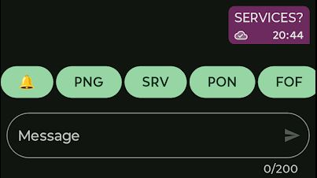
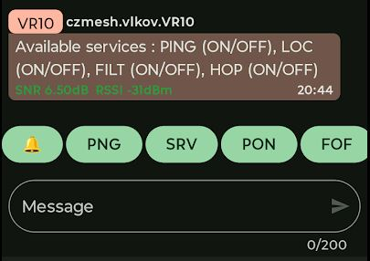
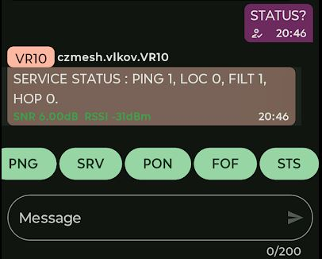
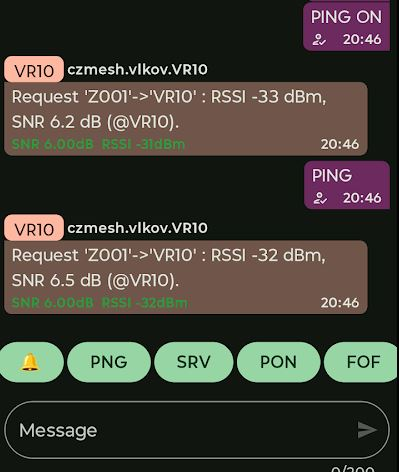

## MESHTASTIC PACKET SLINGSHOT AND NETWORK TRAFFIC OVERHEAD REDUCER

This is an experimental set of custom, purpose-built modifications to the official [Meshtastic firmware](https://github.com/meshtastic/firmware), designed to **help advanced users fine-tune their Meshtastic networks**. This is an early proof-of-concept release intended to explore potential responses to future challenges that may arise as Meshtastic networks grow in size and complexity.

My miscellaneous multi-year experiments in urban areas have shown that the Meshtastic network becomes a functional mesh network within a cluster when the density of nodes (LONG_FAST) reaches a certain threshold:

- At least one node per 10 square kilometers
- An average inter-node distance of approximately 2 km (**density** condition)
- Clusters consisting of at least 20 nodes (**fault tolerance**)
- Each node maintaining direct (no-hop) connections to approximately three other nodes (sufficient **path redundancy**)
- Signal quality better than RSSI > -110 dBm and SNR > -4 dB (**signal quality**)

Once these density and path conditions are achieved, the network may demonstrate over 90% reliability in packet delivery across up to three hops in an urban environment (observed in 2025 in Brno, Czech Republic). For MF (Medium-Fast) mode, my estimate—based on limited observations of very small (exceptionally working) clusters—is that the network would need to be at least 30% denser due to the lower link budget (Yes—nevertheless, despite the obvious theoretical disadvantages of MF and the lack of any practically demonstrated advantages, MF prevailed over LF). 

### REDUCES TRAFFIC BUT BOOSTS PACKET PROPAGATION
This firmware-mod is intended for strategically placed nodes exposed to a high volume of traffic. By **reducing unnecessary packet forwarding, it helps minimize spectrum congestion and prevents network overload or collapse**. On the other hand, this filter guarantees that the **core functionality of the Meshtastic network remains fully operational** — ensuring neighbor node awareness and unrestricted text message forwarding between nodes. The most crucial feature is the **packet-slingshot**, which, in addition to filtering out non-core Meshtastic traffic, forwards packets to a wide neighborhood of strategically placed nodes. These nodes have visibility into other Meshtastic clusters—for example, another 'wally' node or a distant high-elevation node positioned above a separate cluster. **This firmware is non-intrusive to the Meshtastic network**. 

Another benefit of this firmware is it leads to significantly better battery efficiency — in experiments, devices lasted up to 40% longer on a single charge due to fewer packets being sent or retransmitted.

### How to Compile and Install Your Custom Firmware
If you're serious about custom modifications, you should consider using VSCode with PlatformIO. However, for the rest of us, the easiest way is to use a simple online development environment like Gitpod.com. I’ve described the process briefly in this blog post:
[MESHTASTIC – Compiling Your Own Firmware](https://meshtastic--czbrno-blogspot-com.translate.goog/2025/02/meshtastic-kompilace-vlastniho-firmware.html?_x_tr_sl=cs&_x_tr_tl=en&_x_tr_hl=cs&_x_tr_pto=wapp). If you want to compile this custom modification (instead of just the basic “Ping” mod which is included as well), you can use this Gitpod link to get started right away (and follow the process described in post):

**UPDATE 2026-03:** Unfortunately, the original Gitpod project has been moved under the umbrella of the ONA platform, and compilation is now less straightforward, but still doable. You need to be more patient, but you can get it compiled as well.

https://gitpod.io#https://github.com/VilemR/meshtastic_sling_shot.git

### Initial intention
The development of this experimental Meshtastic firmware modification is based on the assumption that growing clusters of Meshtastic users will eventually want to communicate with users in neighboring clusters. Recent experiments have shown that, as these clusters expand, high network utilization is required to support communication beyond the local group—resembling a 'relay site' function. **This project is a response to the potential negative impact on network performance caused by interconnected Meshtastic clusters**. When clusters are linked, internal traffic—such as frequent nodeinfo updates, telemetry, and routing data—tends to propagate to all connected clusters, leading to unnecessary network load.

To address this, the firmware modification slows down or completely blocks the forwarding of non-essential packets to neighboring clusters. When a node running this modified firmware is strategically placed between two clusters, it can act as well as a **slingshot for core Meshtastic traffic—delivering only the crucial packet types needed for cross-cluster communication**. Instead of flooding neighboring clusters with traffic no one needs, the node forwards only essential messages such as text messages and admin configuration packets. It limits the spread of less critical traffic—like nodeinfo or routing updates—to perhaps once per day, and drops all other non-essential packets.

The picture below best describes the intended architecture. It is suitable for large hilly areas interconnected using Packet Slingshot nodes installed at strategic positions, as well as (it might be used) for dense urban environments where it connects specific urban areas or communities (clusters).

On top of the slingshot functionality, this firmware modification includes **two extra features** to help monitor signal quality and network coverage: Ping Command – Allows users to send **ping messages to other nodes, which return signal quality metrics** (e.g., RSSI and SNR). This is useful for quick diagnostics and verifying connectivity across nodes/clusters. Extended Range Test Module – Enhances the existing Range Test functionality by including location updates with each test result. These updates include a **direct link to Google Maps, making it easy to view the exact GPS location where the test was performed**.

In principle, a real mesh network cannot function as a single “universe” cluster due to capacity limits. If one packet sent to a particular node were theoretically delivered to almost all nodes in a large network, it would quickly flood the network. (A solution addressing this issue is the MeshCore project.)

Therefore, the ideal network architecture consists of small clusters of nodes that communicate primarily within their local cluster. Message packets—and especially telemetry, sensor, and other types of data—are exchanged between neighboring nodes within the cluster or local community. Only in rare cases, when a packet needs to be delivered to another cluster, is it handed over via a “slingshot” node. Slingshots can reach multiple clusters—potentially through multiple hops between slingshots—allowing the packet to be efficiently promoted to the target cluster.

**And that’s exactly what the Packet Slingshot does—it is designed to support multi-cluster networks, with the option to intentionally route packets (messages) to specific target cluster(s).**

### What it is not
This firmware is not intended to solve all your problems—especially if you're experiencing basic communication issues with other nodes in the mesh network or poor overall network performance. Before starting your experiments, make sure you are familiar with the basics and have applied common best practices to avoid issues many of us have encountered. In addition to gathering information from various sources, try to consolidate your knowledge by reading a few focused blog posts:

- [A Wrap-up of One Year of Experience](https://meshtastic--czbrno-blogspot-com.translate.goog/2025/01/kapitola-1-po-jednom-roce.html?_x_tr_sl=cs&_x_tr_tl=en&_x_tr_hl=cs&_x_tr_pto=wapp)
- [MediumFast vs LongFast and Other Useful Hints](https://meshtastic--czbrno-blogspot-com.translate.goog/2025/01/meshtastic-moznost-soucasne-existence.html?_x_tr_sl=cs&_x_tr_tl=en&_x_tr_hl=cs&_x_tr_pto=wapp)
- [Recommended Settings for Beginners](https://meshtastic--czbrno-blogspot-com.translate.goog/2025/01/meshtastic-manifest-draft.html?_x_tr_sl=cs&_x_tr_tl=en&_x_tr_hl=cs&_x_tr_pto=wapp)
- [Cheatsheet: How to Compile Your Own Firmware](https://meshtastic--czbrno-blogspot-com.translate.goog/2025/02/meshtastic-kompilace-vlastniho-firmware.html?_x_tr_sl=cs&_x_tr_tl=en&_x_tr_hl=cs&_x_tr_pto=wapp)
- [How to Pick the Right Antenna](https://meshtastic--czbrno-blogspot-com.translate.goog/2025/02/meshtastic-ja-vybrat-antenu.html?_x_tr_sl=cs&_x_tr_tl=en&_x_tr_hl=cs&_x_tr_pto=wapp)
- [Basic Troubleshooting](https://meshtastic--czbrno-blogspot-com.translate.goog/2025/02/meshtastic-zakladni-troubleshooting.html?_x_tr_sl=cs&_x_tr_tl=en&_x_tr_hl=cs&_x_tr_pto=wapp)

### How it works
By default, this node filters out unnecessary Meshtastic traffic to reduce network congestion between clusters. For testing purposes, the **filter can be easily disabled** by sending the direct command `FILT OFF` to the node. This allows for before-and-after comparisons of the filtering effect.

When the filter is enabled, the node reduces or drops non-essential packets, such as frequent nodeinfo broadcasts or telemetry. In contrast, direct text messages sent to the slingshot node using a specific non-default channel are rebroadcast to all reachable nodes across connected clusters. This **selective forwarding ensures that only intended messages are propagated beyond the local cluster**. A non-default channel is used intentionally, so that only users who know the correct pre-shared key (PSK) can access the slingshot functionality. **Users without the correct PSK will not be able to send cross-cluster messages**.

### Custom modifications
It includes a new **SignalReplyModule**, which allows for automated replies to received "Ping" messages. The response can either include RSSI/SNR signal quality (useful for evaluating link performance) or the number of hops the message took to reach the replying node.

Additionally, a modified **Range Test Module** extends the standard "loc" message by including a Google Maps link, making it easier to identify the origin of the tested location.

The most recent release also includes a **modification to the Router class** that reduces airtime usage by dropping non-core Meshtastic packets. This helps prevent excessive load on exposed nodes that serve as relays in large networks. The filtering implementation is based on the pioneering work of CamFlyerCH (Jean-Marc Ulrich). 

**All features can be controlled remotely.** The current version supports the following commands (case insensitive):

 - `Services?` / `Serv?` – Requests a list of services installed on the remote node. The node responds to this command whether it is sent **directly or broadcast on the general channel**. Wherever you are, if a Slingshot-enabled node is within range, sending a command on general channel will return a response with all available features. This is for easy observability. Be aware all remaining commands must be sent directly—and, if designed with access restrictions, using a dedicated channel to control who can use the Slingshot features.
 
 
 - `Status?` / `Stat?` – Requests the status of services on a remote node running this modified firmware. It shows which services are active or inactive. Responds only to direct messages sent to the remote node; broadcast or indirect messages are ignored.
  
 - `Version?` / `Ver?` – Requests the current firmware modification version, indicating the development stage.
 - `Ping ON` / `Ping OFF` – Enables or disables the service that replies to incoming "Ping" requests. **Responds only to direct messages** sent to the remote node; broadcast or indirect messages are ignored.
 - `Ping` – Sends a ping request. The response (if ping service is enabled) includes either signal quality (RSSI/SNR) or the number of hops it took to reach the responding node. Responds only to **direct messages** sent to the remote node. It remains active for approximately 60 minutes before expiring and automatically disabling itself.
 
 - `LOC ON` / `LOC OFF` – Enables or disables the extended "LOC" response, which includes a Google Maps link to the reported location. Responds only to "Range test" module messages broadcast. It remains active for approximately 60 minutes before expiring and automatically disabling itself.
 - `FILT ON` / `FILT OFF` – Enables (ON) or disables (OFF) a custom packet filter implemented in Router.cpp. When enabled, all incoming Meshtastic packet types (PORTNUM) are received and processed locally. However, only core Meshtastic packets are relayed further. Less critical packets (system or overhead traffic) — such as telemetry, ATAK, or unknown types—are either delayed or dropped entirely. **When the filter is disabled, the device reverts to standard Meshtastic routing behavior.**
 - `HOP ON` / `HOP OFF` – Enables (ON) or disables (OFF) the reduction of the HOP value in routed packets if it exceeds a reasonable threshold of 5. When enabled, packets with a HOP value greater than 5 will have it reduced accordingly to limit their time-to-live, helping to prevent excessive propagation and reduce unnecessary network traffic (still under development and testing). HOP reduction disabled by default and is applied only if filter is active!

 By default, the FILTER service is intentionally enabled, while all other services are disabled. If you enable any service other than FILTER, it will remain active for approximately 60 minutes before automatically disabling itself, requiring manual re-enabling. If you disable filtering using the FILT OFF command, the FILTER service will stay disabled until either the FILT ON command is issued or the device is rebooted. 

## How to start using SLING-SHOT feature.
There are two intended scenarios for slingshotting packets to another cluster without cluttering your local cluster. New use cases may be introduced, or existing ones adjusted in the future, to improve user experience and overall network performance.

#### Inter-cluster Communication via Dedicated Channel
Communication with users in a different cluster should be done through a dedicated channel specifically created for this purpose. It is recommended to use a pre-shared key (PSK) shared among **users permitted to access this feature in both clusters**. If Slingshot (filter) is active, it will only forward packets with a known channel. Any packet with an unknown or unrecognized channel is dropped (to avoid unnecessary packets are rebroadcastet to other clusters).

#### Message Forwarding from Default Channel
Messages sent to this node on the default channel—when addressed directly to this node—can be **rebroadcast to all reachable nodes, including those in both the local and remote clusters**. Messages sent on default channel to all are not rebroadcasted via sling-shot to other clusters at all.

